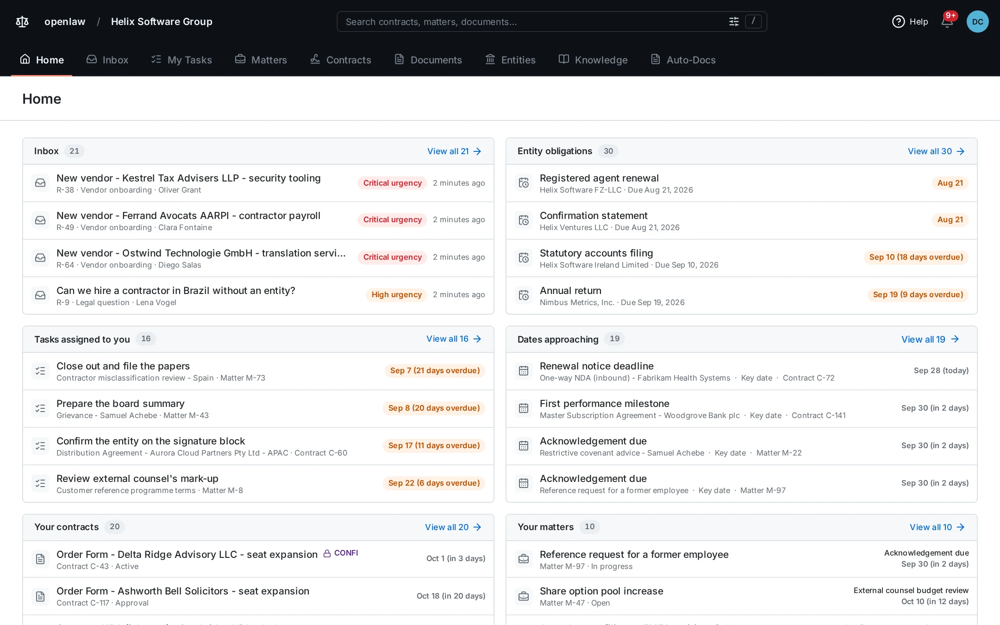
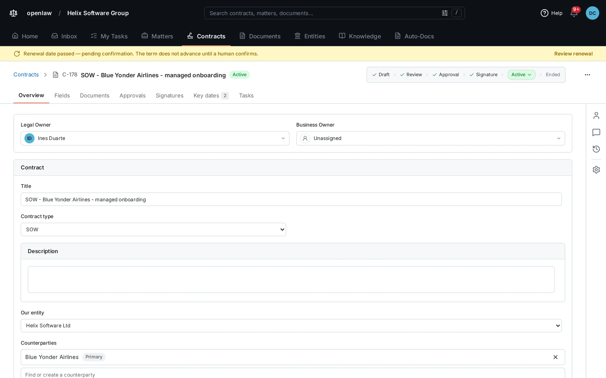
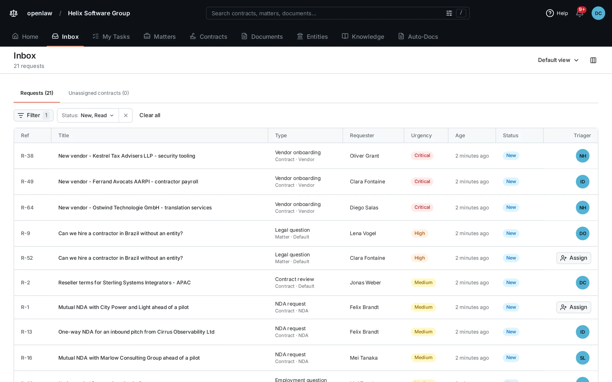
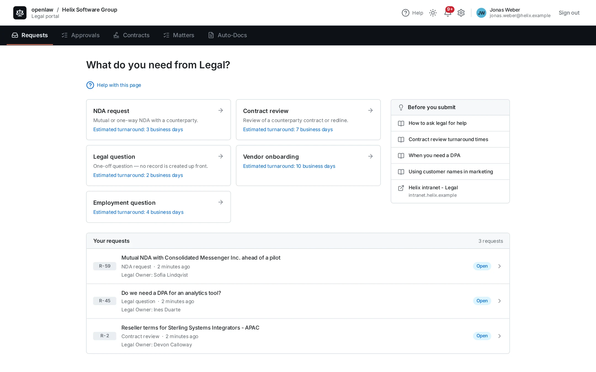
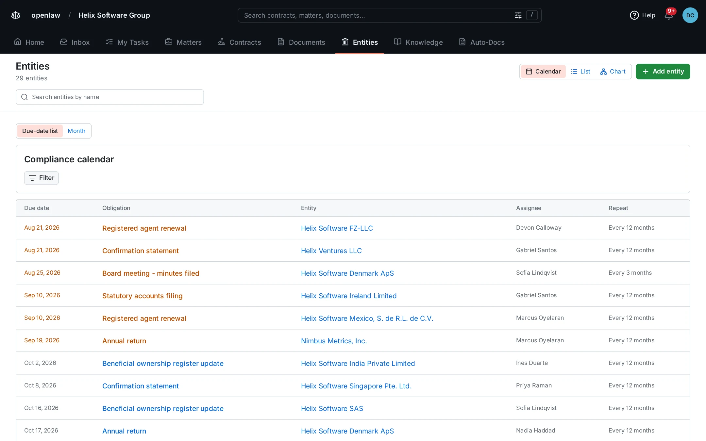

# OpenLaw

Open-source, self-hosted legal operations for small in-house legal teams.

[](LICENSE)
[](https://github.com/juggernog20/OpenLaw/releases/latest)

[Install](#install) · [User guides](docs/user-guides/) · [Changelog](CHANGELOG.md) · [Contributing](CONTRIBUTING.md)

<picture>
  <source media="(prefers-color-scheme: dark)" srcset="docs/assets/readme/home-dark.webp">
  
</picture>

OpenLaw keeps the work of a small in-house legal team in one place. It holds the team's Contracts, Matters, Entities and Knowledge. The rest of the company asks Legal for help through a Portal, so a request no longer lives in one lawyer's inbox.

You run OpenLaw on your own server with Docker Compose. Your contracts and legal advice stay on a machine you control. The software costs nothing. You pay for the server.

## What's in it

| Module                                             | What it does                                                                                                                                                                                                        |
| -------------------------------------------------- | ------------------------------------------------------------------------------------------------------------------------------------------------------------------------------------------------------------------- |
| [Contracts](docs/user-guides/create-contract.md)   | Each contract from draft through approval and signature to renewal and ending. Parallel approvals, Key dates, a notice deadline that OpenLaw calculates from the term, and a Confidential flag for sensitive deals. |
| [Matters](docs/user-guides/create-matter.md)       | Every other piece of legal work: an employment issue, a regulatory inquiry, a board matter. Matter templates add the usual Tasks and Key dates for you.                                                             |
| [Requests](docs/user-guides/submit-request.md)     | Business Users fill in a Form in the Portal. Legal triages each Request in the Inbox, then converts it to a Contract or Matter, resolves it, or declines it. The answers and attachments carry across.              |
| [Entities](docs/user-guides/entity-records.md)     | Your own group companies. Officers, Registrations, statutory Documents, an ownership chart, share, partnership and trust registers, and a compliance calendar of Obligations.                                       |
| [Knowledge](docs/user-guides/create-knowledge.md)  | Guidance and precedents. Publish a Knowledge Item to the Portal, and it can answer a Business User's question before they submit it.                                                                                |
| [Documents](docs/user-guides/document-versions.md) | Every file belongs to one record and keeps a chain of Versions. Previews for Word and PowerPoint, OCR for scanned PDFs, and a redline between any two Versions.                                                     |
| [Auto-Docs](docs/user-guides/auto-doc-template.md) | Upload a Word template. OpenLaw builds a form from its Placeholders and fills it into a `.docx` and a `.pdf`. Business Users can run an Auto-Doc from the Portal too.                                               |

Also in 0.4.0:

- **E-signature through DocuSign.** When everyone has signed, the executed PDF comes back onto the Contract and the Contract becomes active.
- **AI Analysis with your own API key.** It reads a Contract's Document and fills in the term, the value, the notice period and your custom Fields. Each value stays marked Unverified until a person confirms it. It works with Anthropic, OpenAI and Gemini APIs, and with other providers that use the same protocols.
- **An MCP server.** Connect Claude, ChatGPT or Microsoft 365 Copilot. The assistant acts as the person who connected it, with that person's access, and the activity feed names the assistant.
- **Search that reads the files.** Press `/` to search titles, descriptions and the text inside uploaded files, OCR text included.
- **Separate sign-in for Legal and for the Portal.** Each audience gets its own methods: password, magic link, or single sign-on through one or more OIDC providers. Two-factor authentication can be required.
- **Comments with three Visibility tiers.** Legal Only, Working Team and Full Thread. A Legal Only note never reaches the Portal.

|                |                             |
| :------------------------------------------------------------------------------------------------------------------------------------------------: | :----------------------------------------------------------------------------------------------------------------------------------------------: |
|                                                                 A Contract record                                                                  |                                                              The Inbox of Requests                                                               |
|  |  |
|                                                           The Portal, as a Business User                                                           |                                                         The Entities compliance calendar                                                         |

## Who it's for

OpenLaw is for an in-house legal team of 2 to 10 people at a company of 50 to 500. That is usually a General Counsel, a few Counsels or Paralegals, and sometimes a Legal Operations lead. The team has outgrown shared folders and email. Enterprise CLM costs more than its contract volume can justify.

It is the wrong tool for:

- **Solo counsel.** A shared drive and a notes app are enough.
- **Legal departments of 50 or more.** The enterprise CLM and matter management suites serve those teams well.
- **Law firms.** OpenLaw has no client billing, conflict checks or case management.
- **Legal aid and public-sector work.** Docassemble and A2J Author are built for that.

One deployment serves one organization. OpenLaw is not multi-tenant.

## Install

You need a Linux host with Docker Engine and the Compose plugin. A team deployment also needs a TLS reverse proxy and an SMTP relay for invitations and sign-in links.

```bash
git clone https://github.com/juggernog20/OpenLaw.git
cd OpenLaw
cp .env.example .env
# Set the two required secrets. Each gets a different value.
sed -i "s|^AUTH_SECRET=$|AUTH_SECRET=$(openssl rand -base64 32)|" .env
sed -i "s|^OPENLAW_SECRET_KEY=$|OPENLAW_SECRET_KEY=$(openssl rand -base64 32)|" .env
docker compose up -d
```

Open `http://<host>:3000`. A new install opens on first-run setup, which asks for a setup token. If you set `SETUP_TOKEN` in `.env`, enter that value. If you did not, the app makes a new token each time it starts and prints it to its log:

```bash
docker compose logs app | grep -A2 "setup token"
```

Enter the token with the first Administrator's name, email and password. The onboarding wizard then asks for your organization, sign-in methods, outbound email, team and connectors.

Keep a copy of `OPENLAW_SECRET_KEY` in a password manager, and never in the same archive as your database backup. It encrypts the credentials that Administrators save in Settings. A thief with the dump and the key can read those credentials. If you lose the key, Administrators must enter the credentials again, and the saved Advanced configuration is gone. Your Contracts, Matters and Documents do not depend on it.

The release images are for linux/amd64. On an arm64 host, run `docker compose build` before `docker compose up -d`.

Next steps:

- [Install OpenLaw](docs/user-guides/install.md) is the full procedure, with the checks to run after each step.
- [`DEPLOYMENT.md`](docs/DEPLOYMENT.md) covers the reverse proxy, file storage, email, upgrades and backups.
- [Deploy on a private VM](docs/user-guides/deployment-configuration.md#deploy-on-a-private-vm) keeps OpenLaw on the office network or VPN, with no public address.

To look around before you install for real, the demo seed fills a development instance with a fictional company, with a legal team of twelve and thirty Entities. [Seeding a demo instance](docs/DEVELOPMENT.md#seeding-a-demo-instance) tells you how.

## Documentation

The user manual has 62 guides. Each instance also serves the manual at `/documentation` and in the in-app Help.

- **Legal Team Members.** Start with [Find your work on Home](docs/user-guides/find-your-work.md), [Create and maintain a Contract](docs/user-guides/create-contract.md) and [Assign and triage Requests](docs/user-guides/triage-requests.md).
- **Business Users.** [Sign in to the Business Portal](docs/user-guides/portal-sign-in.md), then [Submit a Request to Legal](docs/user-guides/submit-request.md) and [Follow a Request](docs/user-guides/follow-request.md).
- **Administrators.** [Set up a new OpenLaw instance](docs/user-guides/first-run.md), [Manage your organization and users](docs/user-guides/organisation-and-users.md) and [Configure request types and forms](docs/user-guides/request-forms.md).
- **Whoever runs the server.** [Install](docs/user-guides/install.md), [Upgrade a populated instance](docs/user-guides/upgrade.md), [Back up and restore](docs/user-guides/backup-and-restore.md) and [Troubleshoot a deployment](docs/user-guides/operator-troubleshooting.md).

[Look up terms, permissions, and file behavior](docs/user-guides/reference.md) is the reference for all four.

## Project status

0.4.0 is the latest release, from 1 October 2026. The first public release, 0.1.0, came out on 28 September 2026. One maintainer builds OpenLaw. There is no hosted version, so every instance is one that someone runs themselves. Security fixes go into the latest release line only.

Some things are left out on purpose, for now:

- Email-to-intake and Slack or Teams capture. The Portal is the only way to submit a Request.
- Reporting dashboards. Home shows your own work, not org-wide numbers.
- Outside counsel spend and e-billing.
- E-signature providers other than DocuSign.

[`FUTURE-FEATURES.md`](docs/decision-records/FUTURE-FEATURES.md) lists each deferred feature and the reason. Check it before you ask for one.

## Contributing

Read [`CONTRIBUTING.md`](CONTRIBUTING.md) before you open a pull request. Branch off `dev` and target `dev`. `main` only receives releases.

- [`docs/DEVELOPMENT.md`](docs/DEVELOPMENT.md) sets up the local loop, the demo seed and the tests.
- [`CONTEXT.md`](CONTEXT.md) is the glossary. A Request is not a ticket, and an Entity is one of your own companies, never a Counterparty.
- [`docs/decision-records/`](docs/decision-records/) records why OpenLaw works the way it does. [`PRODUCT.md`](docs/decision-records/PRODUCT.md) is the place to start.

## Security

Do not open a public issue for a vulnerability. Report it privately, as [`SECURITY.md`](SECURITY.md) describes.

## License

OpenLaw is licensed under [AGPL-3.0-only](LICENSE). You can use it, change it and run it for your company at no cost. If you change OpenLaw and let people use your changed version over a network, you must offer them its source code under the same license. That includes your own employees.
