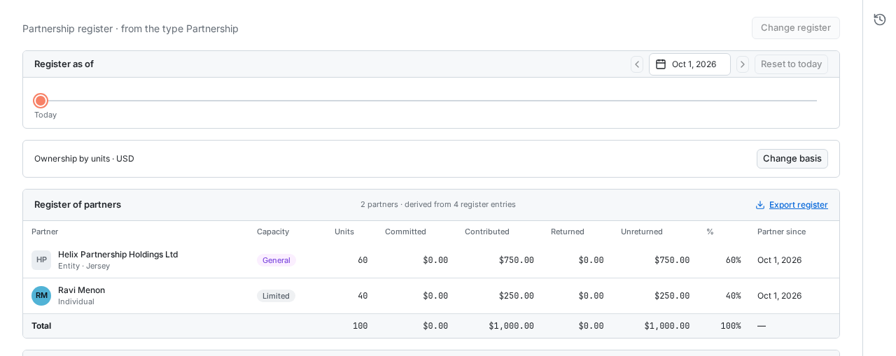
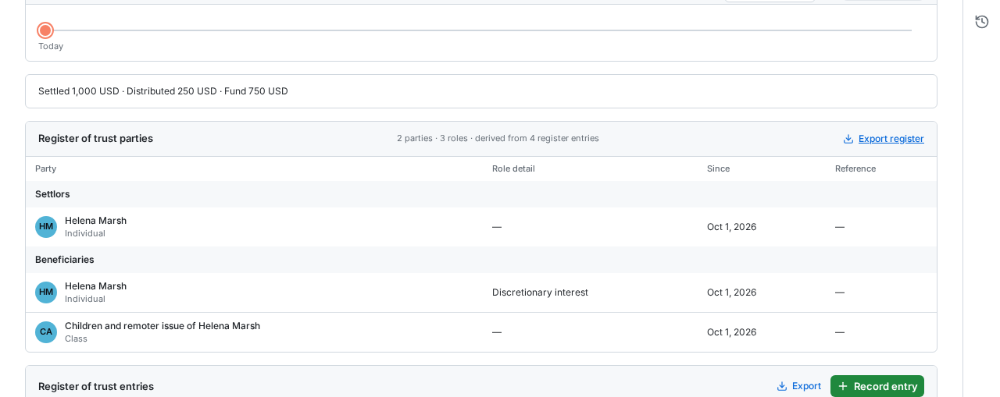

# Manage Entity structure and access

Maintain share-capital facts and the ownership registers, inspect the ownership chart and linked work, and control access to Confidential Entities.

## Before you start

Legal Team Members and Administrators can maintain reachable, live Entities. A Confidential Entity requires a Grant for every person, including Administrators. A person with a Grant on an Entity can change its Confidential flag and Grants. An Administrator can also change them while the Entity is not Confidential. The person who adds an Entity receives a Grant for it. Business Users do not have Entity access. A Holding, a share register entry, an Officer user link, or a linked Contract does not grant access to the Entity.

## Choose the register and head office

An Administrator sets the Entity type's **Register** in **Settings → Entities → Types**:
**Share register**, **Partnership register**, **Trust register**, or **None**.
Open **Ownership** to maintain that register.

The choice locks while a register holds data, including a Share class without entries.
Changing the Entity type cannot bypass this lock.
Corporation, LLC and Other start with Share register; Partnership starts with
Partnership register; Branch starts with None. A refused type change names how many
Entities have register data. On upgrade, an existing share register stays visible
even under a partnership or branch type because OpenLaw pins Share register on that
Entity.

For **None**, Ownership shows **Head office**. Select **Change head office**, choose a
live Entity from the registry, and **Save**. **Clear head office** removes the link.
The Entity cannot name itself or create a loop through other head offices. Changing
to another register kind clears the head office.

## Maintain share capital

1. Open the Entity's **Overview** and find **Share capital**. This card appears only for **Share register**.
2. Enter **Authorized shares** and **Issued shares** as needed. Each accepts a whole number of zero or more; leave a value blank when it is unknown.
3. To record a par value, choose **Currency** first. **Par value** stays unavailable until a Currency is chosen. Then enter the amount in that currency, with no more decimal places than the currency uses.
4. Move focus away or press Enter to save each value. Check its saved result. Press Escape to abandon an unsaved edit.

The card has one **Currency**, and it applies only to the par value. When you change the Currency, the par value amount stays the same. Negative values, fractional share counts, and par values with too many decimal places are refused without replacing the saved value.

A par value saved before par values had a currency shows its stored minor units and a note under the field. Choose a **Currency**. In **Confirm par value currency**, check the amount OpenLaw shows and select **Confirm amount and currency** only if it is correct.

These three values are declared totals. Share classes, Holders, and certificates live in the share register on the **Ownership** tab. That tab compares **Issued shares** with the register's issued total.

## Keep the share register

The share register records each dated movement of shares as a Register entry. OpenLaw works out the Register of members from the entries. You cannot add a Holder by hand. A Holder exists because an entry names it.

### Set up share classes

1. Open the Entity's **Ownership** tab. A new register shows **No share register yet**.
2. Select **New share class**. On a register that already has classes, select **Share classes** on the **Register of members** card instead, then **New share class**.
3. Enter **Name**. Optionally enter **Authorized shares**, **Votes per share** (it starts at 1), **Par value** with its **Currency**, and a **Rights summary**. Leave **Authorized shares** blank for no cap.
4. Select **Save**. The class shows its authorized count, votes per share, and entry count.

A class name must be unique on the Entity. You can edit a class at any time. Its archive control is available only while no entry uses the class.

### Record an entry

In all three registers, **Full name** lets you select an active OpenLaw user or
enter a name for someone outside the user list. Selecting the same user again
reuses their individual record within that register. A new individual with an
existing name is refused, ignoring case and extra spaces; choose the existing
Holder or Party instead. Existing name-only records are not linked automatically.

1. Select **Record entry**. It is unavailable until the Entity has a live share class.
2. Choose **Entry**: **Allotment**, **Transfer**, **Buyback**, **Cancellation**, or **Conversion**. Set **Effective date**. It starts at today.
3. Choose the Holders the entry needs:
   - **Allotment**: **To** only. New shares go from the company to the Holder.
   - **Transfer**: **From** and **To**, two different Holders.
   - **Buyback**: **From** only. The shares go into treasury.
   - **Cancellation**: **From** a Holder, or leave **Treasury (shares the company holds)** to cancel treasury shares.
   - **Conversion**: **From** only, with **From class** and **To class**. The Holder keeps the converted shares.
4. For each Holder, pick an existing Holder, or choose **Entity from the registry…** and pick an Entity, or choose **New individual…** and enter a **Full name**. The registry list leaves out this Entity and archived Entities.
5. Choose **Class** and enter **Shares** as a whole number of 1 or more. Optionally enter **Price per share** with its **Currency**, **Consideration**, **Distinctive numbers**, **Resolution reference**, and **Note**.
6. Under **Certificates**, select the checkbox of each live certificate the entry cancels. To issue a certificate, select **Issue certificate** and enter its number, its Holder, its share count, and optionally its distinctive numbers.
7. Select **Enter in register**. Check the new row in **Register of allotments and transfers** and the Holder's balance in **Register of members**.

To correct an entry, use the edit control in its row. The label has the entry number without leading zeros, for example **Edit entry 3**. The dialog title shows the padded number, **Edit entry 003**. Change the values and select **Save**. To delete the entry, use **Remove entry 3** in its row. The confirmation asks **Remove entry 003 from the register?** Select **Remove**. OpenLaw replays the register without the entry and never reuses its number.

OpenLaw replays the whole register with every change. It refuses an entry that would take any balance below zero on any date, cancel a certificate that is not live for that Holder and class, repeat a certificate number, or create an ownership loop. The refusal shows in the dialog, and the register keeps its saved entries. Allotting more shares than a class authorizes is not refused. A warning such as **1,200 Ordinary shares are issued against 1,000 authorized.** shows above the register.

### Read the register at a date

The register opens at today. To read it at an earlier date, choose the date in **Register as of**, or use **Previous entry date** and **Next entry date** to step between entry dates. **Reset to today** returns to today.

At an earlier date, **Register of members** shows the Holders on that date and a **Change to today** column. Entries after that date stay in the list but are dimmed. The line under **Register as of** states the issued total on that date.

Each class with issued shares has one row per Holder in **Register of members**, a **Treasury** row when the company holds shares of that class, and a total row with the class terms. To narrow the entries list, select **Filter** and choose **Class**, **Entry**, **Holder**, or **Effective date**.

**Export register** downloads the Register of members at the chosen date as a CSV file. **Export** on the entries card downloads every entry as a CSV file, whatever filters are set.

### Check the register against Share capital

The line under **Register as of** compares the register's issued total today with **Issued shares** on **Overview**. When they match, it reads, for example, **Today the register agrees with Share capital: 1,000 issued.** When they differ, it names both figures, for example **Today the register does not agree with Share capital. The Overview declares 900 issued; the register sums to 1,000.** Correct the entries or the declared value until they agree. When **Issued shares** is blank, the line still reports agreement, so enter the declared value before you rely on this check.

### How the register writes Holdings

After each entry change, OpenLaw rewrites this Entity's owner Holdings from today's register. Each Holder's percentage is its outstanding shares across every class over the Entity's outstanding shares, to two decimals. The share register is the source of this Entity's owner Holdings. They appear on the ownership chart and on each owner Entity's **Holdings in other Entities** card, where they show **From register**. You cannot edit them as Holdings; record a register entry instead. Each entry change also appears in the History of this Entity and of each Entity Holder it names.

## Keep the partnership register

A Partner is an Entity from the registry or a named individual. Partnership entries
record admissions, commitments, contributions, returns, transfers, capacity changes
and withdrawals. OpenLaw derives the Register of partners from those entries. You
cannot add a Partner by hand.

### Admit a Partner and record capital

1. Open **Ownership** on an Entity that keeps a **Partnership register**. An empty
   register shows **No partnership register yet**. Select **Record entry**.
2. Choose **Admission** in **Entry** and set **Effective date**. Choose **Entity** in
   **Partner** and select the Entity, or choose **Individual** and select a user or enter **Full name**.
3. Choose **Capacity**, **General** or **Limited**. Enter **Units** and **Stated percent**
   if the agreement uses them. Select **Enter in register**.
4. To record money, select **Record entry**, choose **Commitment**, **Contribution** or
   **Return**, and select the existing Partner. Set **Effective date**,
   **Amount** and **Currency**. A Contribution can also state its **Form of contribution**.
5. Add **Reference** and **Note** when useful. Select **Enter in register** and check
   the Partner's row and totals.

Committed is what the Partner promised. Contributed is what they paid in. Returned
is capital paid back. Unreturned includes capital moved by transfers. The first
money entry sets the register's one currency. OpenLaw refuses money in another
currency or an entry that would take units, stated percent or capital below zero
on any date. The refusal stays in the dialog and does not save the entry.

### Transfer an interest or end a Partner's standing

For **Transfer**, choose **From** and **To**, then enter the units, stated percent
or capital amount to move. Choose **Transferee status**. **Admitted** needs a capacity;
**Assignee** records the economic interest without admitting the recipient as a
Partner. **Consideration** can describe what was exchanged.

Use **Capacity change** to change an existing Partner between General and Limited.
Use **Withdrawal** to end their standing. OpenLaw refuses a withdrawal while that
Partner still holds units, a stated percent or unreturned capital. Transfer or
return those balances first. The ceased Partner remains in the history.

### Choose the Ownership basis

Select **Change basis**, choose a basis, then **Save**. You can change it while the
register has entries. Each entry change and basis change rewrites today's Holdings
and the ownership chart.

| Basis              | Percentage used for Holdings                                                                       |
| ------------------ | -------------------------------------------------------------------------------------------------- |
| Unreturned capital | Each party's unreturned capital divided by the total, including assignees.                         |
| Units              | Each party's units divided by the total units.                                                     |
| Stated percent     | The percent recorded in the entries. A total other than 100 warns but does not refuse the entries. |
| Equal shares       | An equal share for each admitted Partner. Assignees receive no share under this basis.             |

### Read and correct the partnership register

Use **Register as of**, **Previous entry date**, **Next entry date** and **Reset to
today** as on the share register. Each row shows capacity, status, units, committed,
contributed, returned, unreturned, percentage under the basis and Partner since.
Totals close the table. The historic view adds **Change to today**; later entries
remain visible but dimmed. The selected date changes the register read, not today's
Holdings on the chart.

In **Register of partnership entries**, select **Filter** to narrow by **Entry**,
**Partner** or **Effective date**. Use **Edit entry 1** to correct an entry and **Save**.
Use **Remove entry 1**, then **Remove**, only for an entry made in error. Each change
replays the whole register, so a correction can be refused if a later entry would
be invalid. Removed entry numbers are never reused.

**Export register** downloads the Partners at the chosen date as CSV. **Export** on
the entries card downloads all entries, regardless of filters. On an owner Entity,
**Holdings in other Entities** shows **From register** and links back to the
partnership. You cannot edit a Holding there.

## Keep the trust register

A Trust party is an Entity, a named individual or a described class of beneficiaries.
A Role is Settlor, Trustee, Protector, Enforcer, Beneficiary, or Other with a label.
One party can hold several Roles. A class can hold only Beneficiary. Role entries
record appointments, cessations, settlements and distributions. Nobody owns a trust
in this register; it writes no owner Holdings or ownership percentages.

### Record Roles

1. Open **Ownership** on an Entity that keeps a **Trust register**. An empty register
   shows **No trust register yet**. Select **Record entry**.
2. Choose **Appointment** in **Entry** and set **Effective date**. Choose a **Role**.
   **Other** also needs a **Role label**.
3. Choose an existing **Party**, **Entity** with a registry selection, or **Individual**
   with a user selection or **Full name**. For Beneficiary, **Class** lets you enter a **Description**, such
   as "Children and remoter issue of Helena Marsh".
4. Use **Interest or powers** to describe a beneficiary's interest or powers held.
   Add **Reference** and **Note** when useful, then **Enter in register**.
5. To end a Role, record **Cessation** with that party, Role, effective date and reference.
   A cessation keeps the history with an Until date. OpenLaw refuses a duplicate
   appointment or a cessation of a Role the party does not hold on that date.

### Record the trust fund

For **Settlement**, choose the contributing Party, effective date and **Form**.
**Money** needs **Amount** and **Currency**; **Property** needs its description.
The settlement opens the Settlor Role if the party does not already hold it.

For **Distribution**, choose the recipient and fill the same money or property
fields. The recipient must hold Beneficiary on that date. If the dialog refuses
it, check the date and the Role history. Record the appointment only if it reflects
the facts, then record the distribution again. A refused entry changes neither
the register nor its fund.

The fund line shows settled, distributed and balance separately for each currency.
Property descriptions do not become money values. Distributions above settlements
produce a warning rather than a refusal. The fund is a ledger, not a valuation.

### Read and correct the trust register

**Register of trust parties** groups Roles in this order: Settlor, Trustee,
Protector, Enforcer, Beneficiary, Other. Read each party's detail, Since, Until
where shown, and Reference. Use the date controls to read the register at a date;
the historic view shows **Change to today** and dims later entries.

In **Register of trust entries**, **Filter** offers **Entry**, **Role**, **Party** and
**Effective date**. Edit or remove an entry through its row controls. Every correction
replays the Role history, so removing an appointment can be refused when a later
distribution depends on it. **Export register** downloads the parties at the chosen
date as CSV. **Export** on the entries card downloads every entry, regardless of
filters.

A restricted Entity party appears as **Restricted Entity**. A register entry grants
no access. Each write appears in the Entity's Activity and in the Activity of each
Entity party it names. Restore an archived Entity before changing its register.

## Read the ownership chart

1. Open **Entities** and select **Chart**. Create or correct Holdings through the owned Entity's [share register](#keep-the-share-register) or [partnership register](#keep-the-partnership-register).
2. Read the connected Entities and percentages. The chart uses one primary owner to arrange each Entity and draws that Holding as a solid line. Other Holdings remain visible as dashed secondary connections. A branch with no owner Holdings sits below its head office. Other Entities with no Holdings appear in a separate row.
3. Drag to pan or use the mouse wheel to zoom. With the chart focused, use arrow keys to pan, plus or minus to zoom, and zero to fit the chart. **Fit to window** also resets the view.
4. Click an Entity once, or focus it and press Space, to highlight its ownership chain. Select **Clear highlight** or press Escape to remove the highlight. Double-click an Entity, or focus it and press Enter, to open it. A **Confidential Entity** box is an Entity you cannot reach. It shows no name and does not open.

The chart shows the Holdings that share and partnership registers write, between registered Entities and their individual owners. Individuals appear by name, with a person icon and the label **Individual**. Opening an individual takes you to the associated Entity's **Ownership** tab. Individual names follow that Entity's access restrictions and appear in chart exports. An Entity's primary owner is the owner with the highest recorded percentage; it does not require an owner to hold more than 50%. A Holding relationship does not inherit a Status or access permission.

Trust parties connect to the trust with short dashed lines labelled with their current roles, without percentages. Named individuals and classes are terminal cards; a class has a dotted border. Opening either card takes you to the trust's **Ownership** tab. A head office connects to its branch with a solid line labelled **Branch**, also without a percentage. The legend identifies both relationships. Roles do not change the ownership chain.

Disconnected structures appear side by side, aligned at the top. A Holding,
branch or trust-role link connects structures; each keeps its own hierarchy.

You must be able to reach the trust to see its roles and parties, and the branch to see its head-office connection. Reaching only an Entity party or the head office does not reveal an inaccessible trust or branch. An inaccessible Entity party or head office on a visible connection remains a **Confidential Entity** box.

Select **Export chart**, choose the structure and Entity information to include, and select PDF, PowerPoint, PNG or SVG. Role and Branch labels remain when ownership percentages are turned off. Exports include the role and branch connections and dotted class borders.

## Read linked Contracts and Matters

Open the Entity's **Contracts** or **Matters** tab. The tab shows a table with the same columns as the main **Contracts** or **Matters** list, and the number of linked records beside its heading. Archived, ended, and closed records are included. Select a column heading to sort the table. Use **Columns** to show, hide, or reorder columns for this visit. The table shows 50 rows at a time; select **Show more** to add the next rows. **No linked records.** means that no reachable record names this Entity.

Contracts appear through their **Our entity** selection. Matters appear through saved Entity-valued Fields. If such a Field is later detached from the Matter type, its saved value can keep the link until that value is cleared.

Rows, totals, and tab counts reflect the work records you can reach, with the same access rules as the main lists. A Confidential Contract or Matter outside your access contributes neither a row nor a count. Linking it to a reachable Entity does not widen its audience. These tabs show relationships, not stored totals or an analytics report.

## Grant access to a Confidential Entity

A person with a Grant on the Entity performs these steps. While the Entity is not Confidential, an Administrator can also perform them.

1. Open **Overview** and find **Confidentiality**. Select **Manage access**.
2. In **Confidential access**, choose a live Legal Team Member or Administrator in **Person** and select **Grant access**. Confirm that the person appears in the list.
3. Check that the list includes every person who must keep access, including you. When the Entity is Confidential, a person who is not in the list cannot reach it. This applies to Administrators too.
4. Close the dialog. Turn on **Confidential — restrict to the access list** and check the saved result. OpenLaw refuses this change when no live person is in the list.
5. To withdraw access, open **Manage access** and use **Remove name**. Confirm that the person has left the list. OpenLaw refuses to remove the last live person from a Confidential Entity; grant access to another person first. Turning the Confidential switch off makes the Entity available to all Legal Team Members and Administrators without Grants.

A Grant covers this Entity and the records owned by it, subject to the person's existing role. It also lets that person change this Entity's Confidential flag and Grants. It does not confer an Administrator role or unlock linked Confidential Contracts, Matters, or other Entities. A person without the right to change access sees the Confidential switch as unavailable and has no **Manage access** button. An Administrator without a Grant cannot open a Confidential Entity or give themselves a Grant; ask a person with a Grant.

Most unreachable Entities are silently absent from lists, search, calendars, and pickers. Where the app retains a known relationship, such as a Holding, a share register Holder, or a Contract's signing-Entity reference, it can show **Restricted Entity** without the legal name or a navigation link. You can edit a register entry that names a Holder you cannot reach, but you cannot replace or remove that Holder. OpenLaw refuses with **This entry names an Entity you cannot see. That holder stays until someone who can see the Entity changes it.** The ownership chart shows such an Entity as **Confidential Entity**. Removing a Grant preserves the recorded relationship while withdrawing the reader's access.

Restore an archived Entity before changing its facts, share register, or Grants. If a person cannot open an Entity after receiving a Grant, check that the Grant names the correct account, the account is active, and the Entity is the intended record. Follow [roles and access](roles-and-access.md) for the shared access rules.
